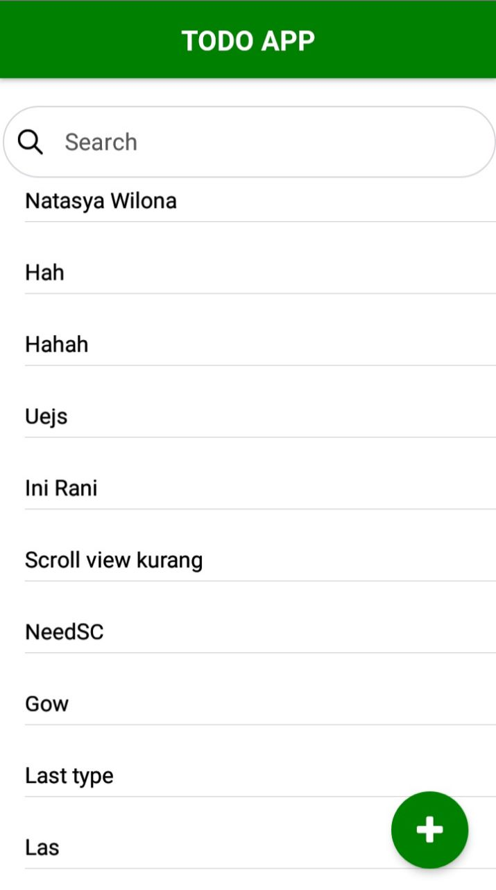
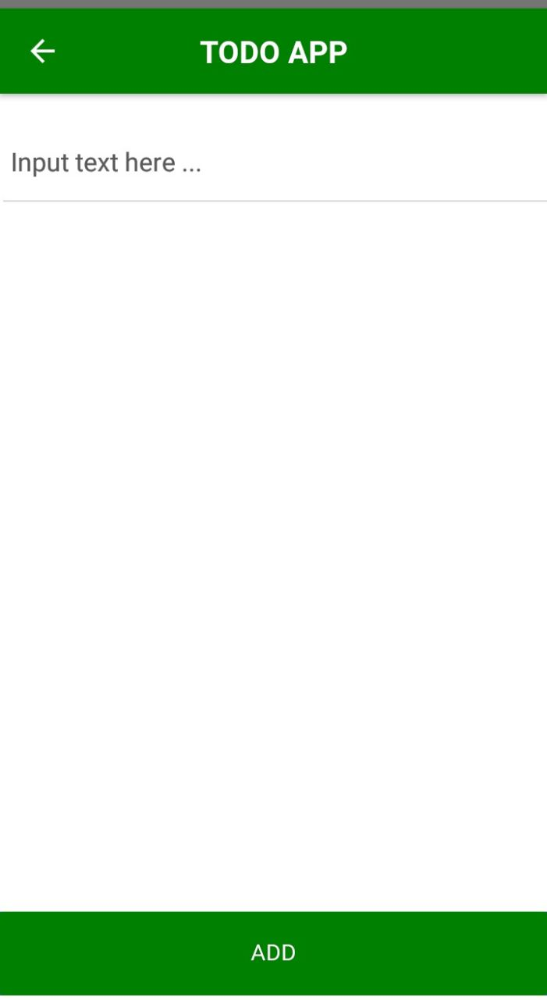

# Test Front End TodoApp React Native
Made by : Rani Triani Gustia 

## Features 
* Filter Search
* Fetch Data From API
* View List Name from DB
* ADD Text From Input Type

## Technology
* React Native As Layouting
* Redux As State Management
* Axios As Request Handler
* MongoDB As Database System
* Express JS As Data API (clone backend from https://github.com/RaniTrianiG/rest-api-TodoApp.git)

## Installations
$ git clone https://github.com/RaniTrianiG/FrontEnd-TodoApp-ReactNative.git
$ git clone https://github.com/RaniTrianiG/rest-api-TodoApp.git
$ cd FrontEnd-TodoApp-ReactNative
$ npm install
$ react-native run-android

## Screenshoot
.                          |  .                        
:-------------------------:|:-------------------------:
  |    
:-------------------------:|:-------------------------:

